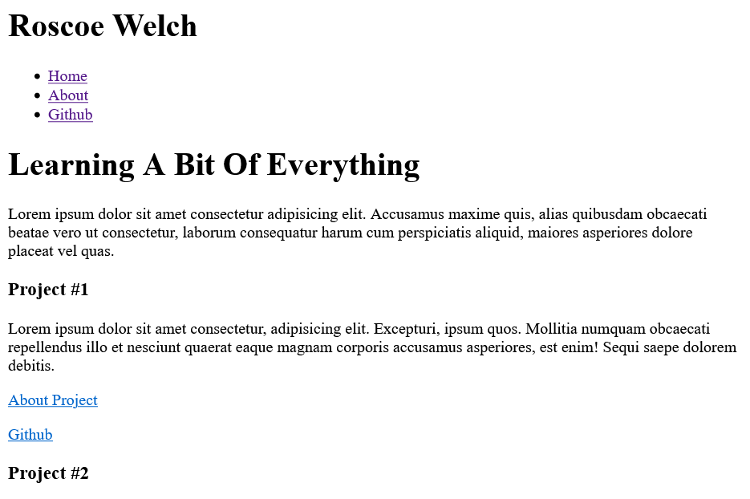
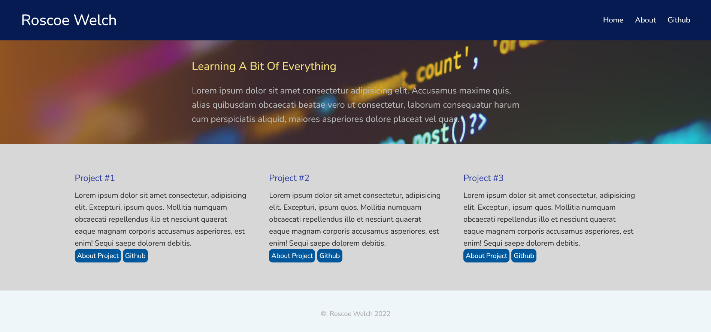

Making The Website
============================

&nbsp;&nbsp;&nbsp;&nbsp;&nbsp;With the exception of short stints of learning the general syntax used in HTML and CSS I never tried to create a website for myself. I started this project to serve as a more organized hub to point to my projects and to give me some practice in the world of web development.

 

**The Start**
-------------

 

&nbsp;&nbsp;&nbsp;&nbsp;&nbsp;At the start of creating this website I decided to document my process. This will be a more informal journal-like approach to better show how I approach these projects from now on. 

&nbsp;&nbsp;&nbsp;&nbsp;&nbsp;I started the website by trying to get just the general idea down with just HTML which gave me this very sleek and modern design.

 

&nbsp;&nbsp;&nbsp;&nbsp;&nbsp;After a little bit of CSS, the site might not be the prettiest thing but I'm no graphic designer and for now I am happy with how its turning out. Next up is making a simple about page just to have a bit more navigation to the site.

